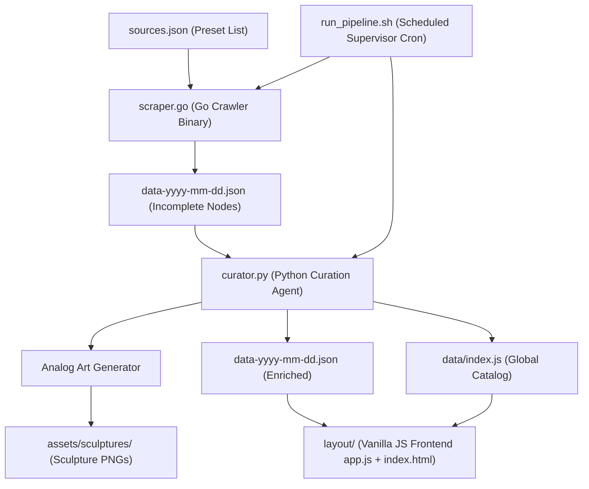

# Phase 1: High-Level Project Vision & Summary

## Project Vision & Final Goal
The ultimate goal of **ai chronicle hub** is to create a premium, editorial weekly AI news showcase and newsletter generation dashboard. The application resolves the dilemma between a web-based archive and a subscriber email newsletter by providing **both** in a single, unified workspace:
1. **Pristine Web Archive**: A highly sophisticated, minimalist web-based interface serving historical editions.
2. **HTML Email Exporter**: A live toggle interface within the app allowing the editor to copy a fully compatible nested-table HTML newsletter draft ready for drop-in dispatch.

The project visualizes content through abstract, looping sculpture imagery in a stark, clean analog style. The design is built on the philosophy of **simplicity**—eliminating boxes, borders, and separator lines to let whitespace and precise typography align elements.

The target visual appearance is defined by this mockup:


---

## Steps to be Taken
To separate concerns, reduce complexity, and structure the development process, the project is planned and executed in discrete phases:
- **Phase 1 (Summary & Architecture Setup)**: Establish directory architecture structures and baseline layouts.
- **Phase 2 (Layout & Visual Presentation)**: Implement the CSS design system, typography (Vernon Adams tribute), WHATWG semantic HTML elements, fluid responsiveness, and interactive hover highlights.
- **Phase 3 (Ingestion & Curation Engine)**: Build the Go systematic scraper and discovery crawler, preset crawler targets, the Python curation agent (Google Antigravity SDK), and set up the monthly JS database schema.
- **Phase 4 (Testing & Verification)**: Run checks for compiler validation, crawling accuracy, semantic validation, and responsive interactive DOM behavior.
- **Phase 5 (Deployment & Operations)**: Orchestrate container builds (Docker multi-stage), scheduling systems (cron), pipeline script run locks, and telemetry systems.

---

## Planned Folder Structure
To separate phases and components during implementation and planning, the project workspace is structured to mirror the core phases:

```text
ai-chronicle-hub/
│
├── .agents/                      # Phase 1: Agentic Rules & Plans
│   ├── rules/
│   │   └── implementation-plan.md  # Master planning structures
│   └── plans/
│       └── newsletter/
│           ├── phase-1-summary.md  # Objectives, Architecture, and Tree
│           ├── phase-2-layout.md   # Visuals, HTML/CSS rules, and transitions
│           ├── phase-3-engine.md   # Go and Python backend engines
│           ├── phase-4-verification.md # Compilation and verification checks
│           └── phase-5-operation.md # Docker, Pipeline script, and Kubernetes PVC
│
├── layout/                       # Phase 2: Visual Layout & Appearance
│   ├── index.html                # Core WHATWG semantic presentation interface
│   ├── styles.css                # HSL variables and typography stylesheets
│   └── app.js                    # Live search and DOM injection engine (Vanilla JS)
│
├── engine/                       # Phase 3: Crawling & Curation Engines
│   ├── sources.json              # Preset crawler target URLs
│   ├── scraper.go                # High-performance Go systematic/discovery crawler
│   ├── go.mod                    # Go module descriptor
│   ├── go.sum                    # Go dependency checksums
│   └── curator.py                # Google Antigravity SDK curation agent (Python)
│
├── data/                         # Data Layer: Storage database layers (kept in place)
│   ├── index.js                  # Index catalog of all compiled weekly editions
│   └── [yyyy-mm]/                # Month-grouped folders
│       └── data-yyyy-mm-dd.json  # Enriched weekly content JSON databases
│
├── operation/                    # Phase 5: Operational & Deployment scripts
│   ├── run_pipeline.sh           # Pipeline execution and run lock orchestrator
│   ├── Dockerfile                # Multi-stage Docker configuration
│   ├── docker-compose.yml        # Container deployment composition
│   └── k8s-deployment.yaml       # Kubernetes pod & PVC configurations
│
└── assets/                       # Global assets (kept in place)
    └── sculptures/               # Enriched analog-style sculpture image files
```

---

## Architectural Design

To support our automated scheduled news pipeline, the system utilizes a series of decoupled components that handle feed crawling, AI-driven content analysis, design asset generation, and presentation logic.



The system's technical elements are structured into distinct architectural layers aligned with the implementation phases:

### Phase 2: Visual Layout & Appearance (Frontend Layer)
- **Web Archive UI (`layout/index.html` & `layout/app.js`)**: A semantic, borderless user interface. Its aim is to dynamically load index catalogs, retrieve weekly JSON databases on demand, provide real-time client-side search, and render content cards to the DOM.
- **HTML Email Exporter (integrated in `layout/app.js` & `layout/index.html`)**: A workspace utility allowing the editor to preview and copy compiled, table-based email layouts for newsletter dispatch.
- **Styling System (`layout/styles.css`)**: Implements the visual philosophy of simplicity using curated color tokens, Vernon Adams typography (Tinos & Oxygen), and soft gold hover interactions.

### Phase 3: Ingestion & Curation Engine (Backend Layer)
- **Preset Crawler Configuration (`engine/sources.json`)**: Acts as the centralized configuration database storing the systematic URLs, source tags, and target content formats (articles, podcasts, videos, or dashboards) to be scanned.
- **High-Performance Go Crawler (`engine/scraper.go`)**: A compiled, concurrent worker binary. Its aim is to systematically crawl the target domains listed in `sources.json` (Stage 1) and discover new relevant links (Stage 2), registering new records with only titles and URLs.
- **Curation Agent (`engine/curator.py`)**: An autonomous Python script using the Google Antigravity SDK. Its aim is to browse crawled URLs, summarize the core content, generate labels, and extract authors and timezone-offset dates.
- **Analog Art Generator**: A python-driven image generation component invoked by the curation agent. Its aim is to render twist-sculpture continuous squircle PNG graphics in analog tones under `assets/sculptures/`.
- **Weekly Chronicle Database (`data/[yyyy-mm]/data-yyyy-mm-dd.json`)**: Month-grouped weekly JSON databases containing curated entries categorized into releases, breakthroughs, and news.
- **Global Chronicle Index (`data/index.js`)**: A registry tracking all available weekly edition dates to populate the frontend selection dropdown dynamically.

### Phase 5: Operational & Deployment Specification (Infrastructure Layer)
- **Execution Supervisor (`operation/run_pipeline.sh`)**: A system shell runner executing under cron schedules. It utilizes file locks (`curator.lock`) to prevent concurrent write overlaps and logs pipeline telemetry.
- **Deployment & Telemetry Configurations (`operation/Dockerfile`, `operation/docker-compose.yml`, K8s configs)**: Package the applications into containers, define persistent volumes, configure Kubernetes deployments, and direct telemetry logging.

---

## Data Flow & Interoperability Trace

The diagram below details the trace of a news payload from ingestion to DOM presentation:

```text
[sources.json] ──(Read Preset List)──> [scraper.go]
                                             │
                                   (Systematic Crawl)
                                             │
                                             ▼
                             [data/yyyy-mm/data-yyyy-mm-dd.json] 
                              (Contains only Title and URL)
                                             │
                                             ▼
          [curator.py] (Google Antigravity SDK Curation Agent)
               │
       (Browse URL & Fetch Content)
       (Enrich Summary, Labels, Author, Date)
       (Generate Sculpture Image in assets/sculptures/)
               │
               ▼
  [data/yyyy-mm/data-yyyy-mm-dd.json] ──(Update global data/index.js)
               │
               ▼
   [index.html] ──(Load data/index.js)──> [app.js]
                                              │
                                  (Select dynamic edition)
                                              │
                                              ▼
                             (fetch() loads data-yyyy-mm-dd.json)
                                              │
                                              ▼
                                (Renders Content Cards to DOM)
```
