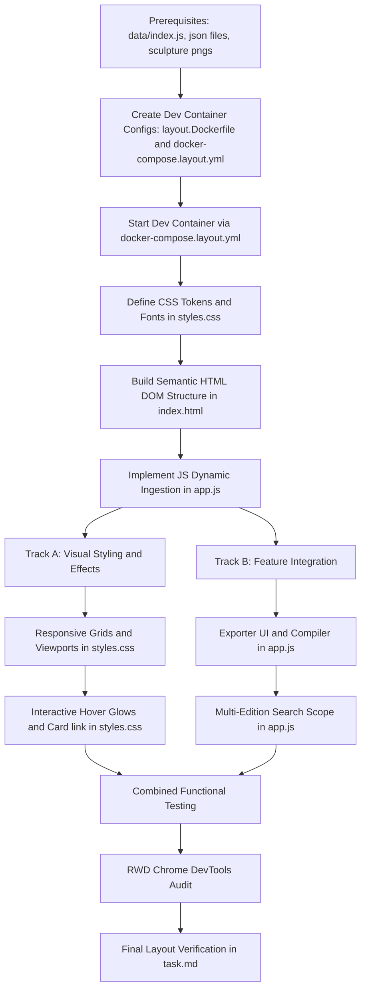

# Phase 2 Layout: Step-by-Step Implementation Map

This document outlines the sequential and parallel execution paths for building and verifying the presentation layer (**Phase 2**) of the **ai chronicle hub**.

---

## 1. Prerequisites (Already Produced Resources)

Before beginning Phase 2 layout implementation, verify that the following core data resources and assets are present in the workspace. These act as the source feed for our dynamic frontend layout:

1. **Global Edition Index Catalog**:
   - File: `data/index.js` (Created). Tracks active testing edition dates.
2. **Weekly Test JSON Databases**:
   - Files: `data/2026-06/data-2026-06-08.json` and `data/2026-08/data-2026-08-01.json` (Created). Grouped by month folders, containing mock articles with summaries, authors, timestamps, and sculpture paths.
3. **Sculpture Graphic Assets**:
   - Files: `assets/sculptures/sculpture_1.png` to `sculpture_8.png` (Created). Grayscale analog sculpture illustrations referenced by the JSON databases.
4. **Empty Frontend Shells**:
   - Files: `layout/index.html`, `layout/styles.css`, and `layout/app.js` (Created). Empty placeholder shells ready to receive implementation code.

---

## 2. Implementation Flowchart

The diagram below maps out the dependencies. Sequential steps flow top-to-bottom, while parallel streams run side-by-side:



### 2.1 Flowchart Description & Traceability Matrix

To ensure full traceability of the implementation path, the flowchart's transitions and stages are described below:

1. **Pre-requisites & Local Server Setup**:
   - **Prereq (Prerequisites)**: The existing index catalog (`data/index.js`), weekly JSON databases, and sculpture PNG assets must be validated as present.
   - **S0 (Create Dev Container Configs)**: Create the static web server Dockerfile (`operation/layout.Dockerfile`) and Compose configuration (`docker-compose.layout.yml`). This step produces the configuration files required to run the local server.
   - **S1 (Start Dev Container)**: Executes the Docker Compose command to spin up Nginx, mounting the workspace folders. This must run before writing CSS/JS to ensure relative paths resolve on a local HTTP port without CORS issues.

2. **Sequential Core (Foundation Setup)**:
   - **S2 (CSS Tokens & Fonts)**: Load Google Fonts (Tinos & Oxygen) and declare color tokens inside `layout/styles.css`. This provides the visual foundation.
   - **S3 (Semantic HTML DOM)**: Code the markup skeleton in `layout/index.html` referencing `styles.css`.
   - **S4 (JS Dynamic Ingestion)**: In `layout/app.js`, link the elements created in S3 to populate selector menus and fetch the weekly JSON files dynamically.

3. **Branching Points (Parallel Tracks)**:
   - Once the basic cards load, work splits into two concurrent streams:
     - **Track A (Visual Styling & Effects)**:
       - **S5 (Responsive Grids)**: Apply CSS grid grids, clamp typography, viewport spacing, and margin padding.
       - **S6 (Interactive Hover Glows & Card link)**: Implement continuous squircle image shapes, card hover animations, and the `::after` pseudo-element clickable overlay.
     - **Track B (Feature Integration)**:
       - **S7 (Exporter UI & Compiler)**: Code the toggle drawer in the HTML and the JavaScript compiler rendering table-based markup for copy-to-clipboard.
       - **S8 (Multi-Edition Search)**: Implement client-side keyup query matching across the current and historical database entries.

4. **Join & Verification Phase (Validation Gates)**:
   - **V1 (Combined Functional Testing)**: Verify layout search filters and copy-to-clipboard compiler actions run concurrently without visual layout breaks.
   - **V2 (RWD Chrome DevTools Audit)**: Test viewports on simulated Pixel 7, Asus Zenbook Fold, iPad Pro, and Nest Hub Max targets.
   - **V3 (Final Layout Verification)**: Mark the Phase 2 checklist as completed in the master `task.md`.

---

## 3. Step-by-Step Execution Plan

These steps list the exact actions, files created, and target verification outcomes for each block:

### [S0] Create Dev Container Configs
- **Action**: 
  - Create layout Dockerfile: [operation/layout.Dockerfile](file:///Users/horvathgergo/.gemini/antigravity/scratch/ai-chronicle-hub/operation/layout.Dockerfile)
  - Create layout Compose file: [docker-compose.layout.yml](file:///Users/horvathgergo/.gemini/antigravity/scratch/ai-chronicle-hub/docker-compose.layout.yml)
- **Target File Contents**:
  - `layout.Dockerfile`: Use `nginx:alpine`, copy `layout/`, `data/`, and `assets/` to `/usr/share/nginx/html/`, and add root redirect script.
  - `docker-compose.layout.yml`: Setup service mounting local directory volume paths for instant hot-reload feedback.
- **Verification**: Check that both configuration files are created and syntax-valid.

### [S1] Standalone Dev Container Setup
- **Action**: Launch the server container using:
  ```bash
  docker-compose -f docker-compose.layout.yml up --build -d
  ```
- **Verification**: Open `http://localhost:8080` in the browser; verify the Nginx welcome page or fallback script redirects without connection failures.

### [S2] Define CSS Tokens & Typography System
- **Action**: In `layout/styles.css`:
  - Load Google Fonts Tinos (serif) and Oxygen (sans-serif) via `@import`.
  - Declare `:root` HSL color tokens (`--canvas-bg: #f5f4f0`, `--text-primary: #161616`, `--title-bronze: #5c533c`, `--accent-gold: #c5a059`, `--glow-gold: rgba(197, 160, 89, 0.08)`).
- **Verification**: Inspect page body element using browser inspector, verifying the background matches the eggs-shell limestone shade (`#f5f4f0`).

### [S3] Construct Semantic HTML DOM Structure
- **Action**: In `layout/index.html`, establish WHATWG semantic blocks:
  - `<header>`: Branding title "ai chronicle hub" and search input.
  - `<nav>`: Frames options and exporter toggle buttons.
  - `<main>`: Central grid containing three `<section>` categories.
- **Verification**: Verify that the elements display in standard raw browser layout without double-wrapped anchor tags.

### [S4] Implement JS Dynamic Ingestion
- **Action**: In `layout/app.js`:
  - Load and parse catalog dates inside `data/index.js` to populate the selection dropdown.
  - Bind change listeners to fetch selected JSON database files dynamically (e.g. `data/2026-06/data-2026-06-08.json`).
  - Render basic card titles, summaries, and dates inside their columns.
- **Verification**: Swap dropdown options in browser and verify network tab logs successful fetches of JSON files, updating text on the screen.

### [S5] Responsive Grids & Viewport Constraints (Track A)
- **Action**: In `layout/styles.css`:
  - Configure the layout using CSS Grid auto-fit (`repeat(auto-fit, minmax(320px, 1fr))`).
  - Set fluid font sizes on headers using `clamp()`.
  - Apply the simplicity rule: zero borders; spacing established purely by margins and padding.
- **Verification**: Check that resizing the browser wraps columns smoothly without causing horizontal scrolls.

### [S6] Interactive Hover Glows & Card link (Track A)
- **Action**: In `layout/styles.css`:
  - Apply `border-radius: 24px` and aspect-ratio 1.5 to `.sculpture-container`.
  - Add transition rules for `:hover` triggers on `.content-card`: transition title color to `var(--accent-gold)` and add `box-shadow: 0 16px 48px var(--glow-gold)` with `transform: translateY(-2px)` on the image container.
  - Code pseudo-element card overlay: `.content-title a::after` absolute position expanding to the relative `.content-card` box.
- **Verification**: Hover over cards, verifying that titles turn gold, image boxes glow softly and rise, and clicking any area of a card redirects to the source URL in a new tab.

### [S7] HTML Email Exporter UI & Compiler (Track B)
- **Action**: 
  - Add exporter panel trigger button to `layout/index.html`.
  - In `layout/app.js`, code the compiler to iterate over loaded dataset items, placing summaries, titles, and paths into Nginx/email-compatible table HTML nested layouts.
  - Bind click action to copy compiled HTML to the clipboard.
- **Verification**: Click export, copy output, paste into a test email body, and verify the resulting table structure matches the newsletter design.

### [S8] Multi-Edition Search Scope (Track B)
- **Action**: In `layout/app.js`, implement dynamic keyup filters. When a query is typed, the search loops through both the active edition and the other indexed edition files, matching keywords in titles, summaries, and labels to render matching result cards.
- **Verification**: Type keywords in the search bar and verify cards instantly filter in real-time.

---

## 4. Verification & Validation Gates

These final tests must be passed before closing the phase:

### [V1] Combined Functional Testing
- Verify that searching filters elements correctly while the email exporter is toggled.

### [V2] Chrome DevTools RWD Audit
- Open Chrome DevTools device bar and verify layout displays correctly without clipping, overlapping, or overflowing on:
  - **Pixel 7**
  - **Asus Zenbook Fold**
  - **iPad Pro**
  - **Nest Hub Max**

### [V3] Task Tracking Completion
- Check off Phase 2 layout tasks inside the master [task.md](file:///Users/horvathgergo/.gemini/antigravity/brain/3b4f367d-7930-4a22-a45d-adec7c366002/task.md) tracking document.
