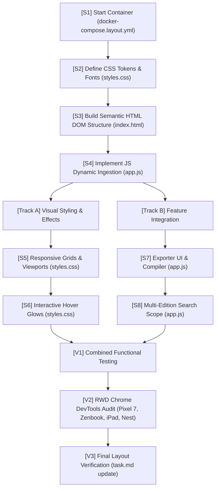

# Phase 2 Layout: Step-by-Step Implementation Map

This document outlines the sequential and parallel execution paths for building and verifying the presentation layer (**Phase 2**) of the **ai chronicle hub**.

---

## 1. Implementation Flowchart

The diagram below maps out the dependencies. Sequential steps flow top-to-bottom, while parallel streams run side-by-side:



---

## 2. Sequential Execution Steps (Step-by-Step)

These tasks have strict dependencies and must be performed in chronological order:

### [S1] Standalone Dev Container Setup
- **Action**: Launch the lightweight Nginx server using the command:
  ```bash
  docker-compose -f docker-compose.layout.yml up --build -d
  ```
- **Aim**: Run a local HTTP host on `http://localhost:8080` to resolve CORS browser blockages during dynamic data fetches.

### [S2] Define CSS Tokens & Typography System
- **Action**: In `layout/styles.css`:
  - Load Google Fonts **Tinos** (serif) and **Oxygen** (sans-serif).
  - Declare `:root` HSL color properties (`--canvas-bg`, `--text-primary`, `--title-bronze`, `--accent-gold`, `--glow-gold`).
- **Aim**: Set up the baseline editorial design tokens.

### [S3] Construct Semantic HTML DOM Structure
- **Action**: In `layout/index.html`, establish WHATWG semantic blocks:
  - `<header>`: Branding title and search input.
  - `<nav>`: Active toggles (email exporter).
  - `<main>`: Main workspace containing three category columns.
  - `<section id="releases">`, `<section id="breakthroughs">`, `<section id="news">`: Category grids.
- **Aim**: Establish the skeleton markup without any nested `<a>` link tags.

### [S4] Implement JS Dynamic Ingestion
- **Action**: In `layout/app.js`:
  - Fetch `data/index.js` catalog dates and populate the dropdown menu.
  - Listen for dropdown change events to trigger `fetch()` of the selected `data-yyyy-mm-dd.json` database.
  - Clear columns and dynamically inject content cards (`<article>`) to the DOM.
- **Aim**: Map dataset inputs to layout components.

---

## 3. Parallel Execution Tracks

Once S4 is complete, developer actions split into two parallel tracks that can be worked on concurrently:

### Track A: Visual & Responsive Styling (CSS Focus)
* **[S5] Responsive Grids & Viewport Constraints**:
  - Implement fluid column scaling using CSS Grid (`repeat(auto-fit, minmax(320px, 1fr))`).
  - Declare fluid font sizes using `clamp()`.
  - Apply the simplicity rule: zero borders or solid divider rules; whitespace padding only.
* **[S6] Interactive Hover Highlights & Transitions**:
  - Add continuous squircle rules for images (`border-radius: 24px`, aspect-ratio 1.5).
  - Code transitions on card hover: title font color shifts to `--accent-gold`, and container scales and drops a soft `--glow-gold` shadow.
  - Implement the clickable pseudo-element overlap (`.content-title a::after`) to make cards clickable.

### Track B: Application & Exporter Features (JS Focus)
* **[S7] HTML Email Exporter UI & Compiler**:
  - Build the toggled template drawer/drawer overlay.
  - Code the compiler logic: iterate over active dataset objects and assemble an email-compatible, nested table HTML string.
  - Bind the copy-to-clipboard button action.
* **[S8] Multi-Edition Search Scope**:
  - Code search query logic: listen to keyboard input in the search bar.
  - Implement query filtering that matches title, summary, or labels across the active issue as well as all historical issues listed in the index catalog.

---

## 4. Final Layout Verification & Audit

After merging Track A and Track B, complete the verification:

### [V1] Combined Functional Testing
- Verify that search input filters cards instantly without breaking visual grids.
- Verify that copy-to-clipboard outputs correct table-based HTML markup.

### [V2] Chrome DevTools RWD Audit
- Open Chrome DevTools and assert correct visual alignment, font scaling, and zero horizontal scrolling on:
  - **Pixel 7** (collapsing to single column, options drawer transitions)
  - **Asus Zenbook Fold** (folding grid dimensions, touch targets)
  - **iPad Pro** (2/3 grid layouts)
  - **Nest Hub Max** (wide desktop grid display)

### [V3] Task Tracking Completion
- Mark Phase 2 tasks as completed inside the [task.md](file:///Users/horvathgergo/.gemini/antigravity/brain/3b4f367d-7930-4a22-a45d-adec7c366002/task.md) checklist.
