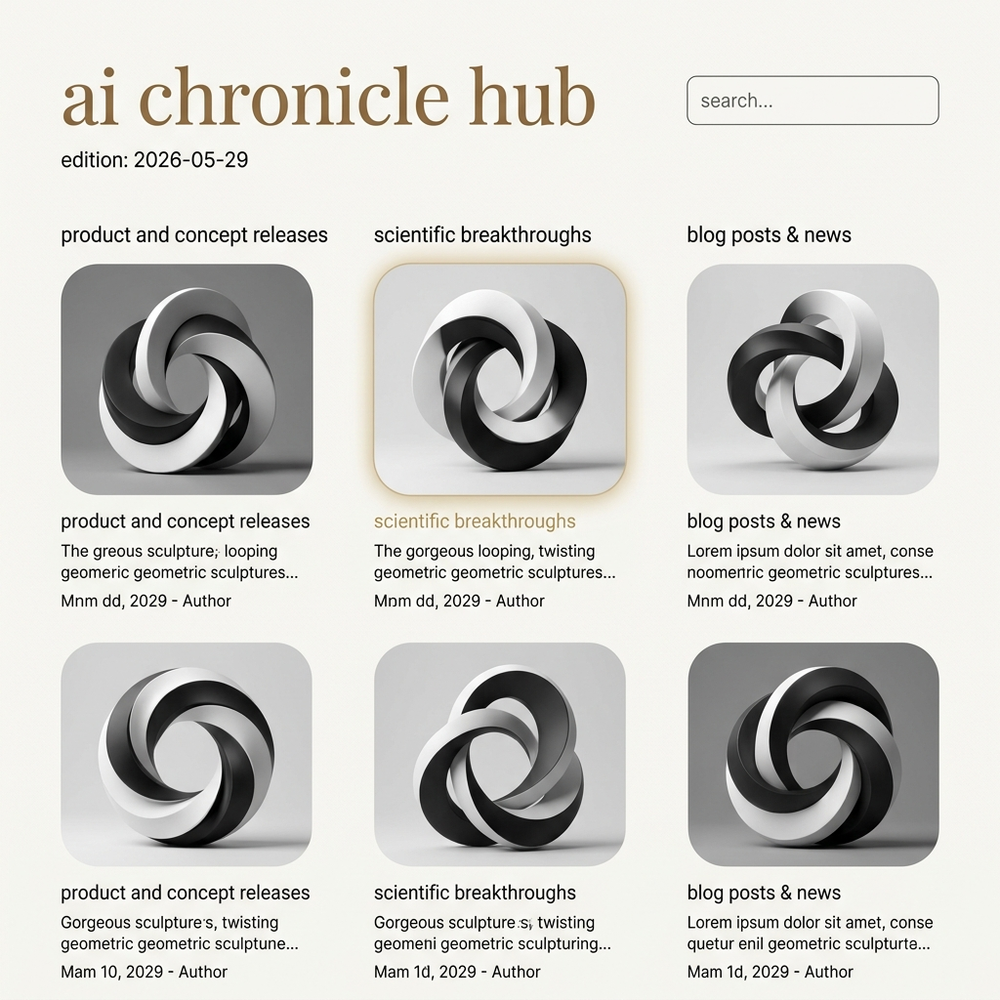

# Phase 2: Visual Layout & Appearance Specification

This document details all requirements, styling constraints, HTML semantics, and CSS instructions for the presentation layer of the **ai chronicle hub**.

---

## 1. Visual philosophy & Mockup Reference
The design is built on the philosophy of **simplicity**—eliminating boxes, borders, and separator lines to let whitespace and precise typography align elements.

The target visual appearance is defined by this mockup:



---
## 2. Structural Elements of the Web Page

This section defines the core visual components of the dashboard interface, their purpose, and the underlying data layer they are built upon.

### 2.1 Branding Title & Search Bar
- **Description**: Positioned at the very top of the layout. The branding title displays the lowercase serif string "ai chronicle hub" as the primary page identifier. The search bar is a sharp, clean text input field aligned on the right.
- **Data Source & Dynamic Bindings**:
  - **Branding Title**: Built on static HTML template content.
  - **Search Bar**: Captures real-time text input on the client-side. The JavaScript controller (`app.js`) binds a keyup listener to search and filter content cards. The search looks through the current/most recent edition as well as all historical issues. Cards are matched by searching for matching text in their titles, summaries, and tags (labels).

### 2.2 Edition Identifier & Selector
- **Description**: Positioned on the left, directly underneath the main branding title. It displays the current newsletter edition date in the format of yyyy-mm-dd (e.g. `2026-06-08` which stands for 8th of June, 2026) and includes a borderless selector dropdown to navigate through historical issues.
- **Data Source & Dynamic Bindings**:
  - The list of selectable options is populated dynamically by loading the catalog array `availableEditions` from the global configuration file `data/index.js`.
  - On page load, the selector defaults to the latest available edition.
  - Selecting a different date option triggers a client-side `fetch()` call to retrieve the corresponding weekly JSON database (`data/yyyy-mm/data-yyyy-mm-dd.json`) in real-time.

### 2.3 Group of Categories (Three-Column Layout)
- **Description**: The core content workspace of the archive, arranged as three vertical columns:
  1. **`product and concept releases`**: Displays cards covering commercial product updates, open-source model releases, and tool updates.
  2. **`scientific breakthroughs`**: Focuses on research paper abstracts, algorithm developments, and computational methodologies.
  3. **`blog posts & news`**: Captures opinion editorials, community articles, and general announcements.
- **Data Source & Dynamic Bindings**:
  - Built upon the weekly database file (`data/yyyy-mm/data-yyyy-mm-dd.json`) fetched based on the active selector option.
  - The JSON document exposes three distinct arrays matching the category keys: `"product and concept releases"`, `"scientific breakthroughs"`, and `"blog posts & news"`.
  - Each item in the category array is a structured object populated into a content card template containing:
    - `title`: Lowercase serif bold text.
    - `picture`: Local path to a generated abstract sculpture PNG.
    - `url`: Direct source link.
    - `summary`: High-fidelity editorial summary.
    - `labels`: Tag array for search/filtration.
    - `date`: ISO 8601 offset timestamp.
    - `author`: Content source author.

### 2.4 Content Cards / Tiles
- **Description**: Individual visual cards arranged within the category grids, displaying curated information.
- **Content Elements**:
  - Grayscale sculpture-based picture.
  - Actionable bold serif content title, with an embedded link anchor (`<a>` tag) leading to the original article source.
  - Short high-fidelity editorial summary written by the curation agent.
  - Original author's name.
  - Date of the article.
  - *Note on labels*: The article tags (labels) are **not** visually rendered on the cards. They are used exclusively behind the scenes for search query matching.
- **Data Source & Dynamic Bindings**: Built dynamically using the selected weekly JSON database (`data/yyyy-mm/data-yyyy-mm-dd.json`), binding the `title`, `picture`, `url`, `summary`, `author`, and `date` attributes of each item object to its respective HTML element.

### 2.5 Email Exporter Panel / Toggle Drawer & Controls
- **Description**: A secondary workspace (implemented as a full-screen toggle drawer / exporter panel) activated by clicking the "Export Email" trigger button. In accordance with the grill-me alignment (Full-Workspace Toggle), toggling this view completely hides the 3-column web archive and swaps the workspace to display a single-column visual preview of the compiled email newsletter, acting as a toggle drawer that transitions into view.
- **Visual Components**:
  - **Exporter Panel Trigger Button**: A button styled in Oxygen sans-serif (lowercase) located in the navigation header on the right, labeled "export email" (or "export") to activate the email compatible HTML view.
  - **Copy Action Button**: A centered, prominent action button (labeled "copy email html") styled in bold Tinos bronze, placed above the template preview.
  - **Back Trigger**: A "back to web archive" button that swaps the view back to the 3-column grid.
  - **Email Preview Canvas**: A centered, single-column document preview (`max-width: 600px` to match typical email clients) showing the compiled layout using nested-table mockups.
- **Data Source & Dynamic Bindings**: The JavaScript compiler (`app.js`) iterates over the currently active edition's articles, wraps their content (titles, summaries, and paths) into inline-styled nested `<table>` tags, and injects this HTML string into the preview container. Clicking the "copy email html" button copies this raw compiled HTML string to the system clipboard.

---

## 3. Rules of the Building Blocks

This section lists the layout, styling, typography, and interactive rules governing the dashboard components, along with their scope of impact.

### 3.1 CSS Design System & HSL Tokens
- **Scope**: Global (applies to the entire canvas and styling context).
- **Rule Details**: Custom HSL variables defined in `:root` of `styles.css` control colors and timings to maintain layout simplicity:
  ```css
  :root {
    /* Stark limestone/eggshell canvas background */
    --canvas-bg: #f5f4f0;            /* HSL: hsl(48, 16%, 95%) */

    /* Deep charcoal-black for highly readable body copy */
    --text-primary: #161616;         /* HSL: hsl(0, 0%, 9%) */

    /* Antique bronze/gold for the main single-line brand title */
    --title-bronze: #5c533c;         /* HSL: hsl(43, 21%, 30%) */

    /* Soft, quiet gold for active text hover highlights */
    --accent-gold: #c5a059;          /* HSL: hsl(40, 50%, 56%) */

    /* Semi-transparent soft gold glow shadow (8% opacity) */
    --glow-gold: rgba(197, 160, 89, 0.08);

    /* Precise transitional timing (Apple-style ease-out) */
    --transition-smooth: cubic-bezier(0.25, 1, 0.5, 1);
  }
  ```

### 3.2 HTML Structuring & Semantics
- **Scope**: Layout structure of all web pages.
- **Rule Details & Affected Elements**:
  - `<header>`: Encapsulates the branding title and the search input bar.
  - `<nav>`: Frames the options and the exporter toggle. In accordance with the aligned layout flow, clicking the exporter toggle triggers a full-workspace toggle that completely swaps the view between the 3-column archive grid and the single-column email preview.
  - `<main>`: Wraps the three category columns.
  - `<section>`: Houses each of the three category column grids.
  - `<article>`: Represents individual content cards.
  - `<time>`: Renders publication dates using structured ISO attributes.
  - `<select>`: The borderless historical edition selector.
  - `<a>`: Embedded within the content title, wrapping the title text:
    ```html
    <h3 class="content-title">
      <a href="SOURCE_URL" target="_blank" rel="noopener noreferrer">title text</a>
    </h3>
    ```
    This ensures that the card is semantically anchored to the source URL. To make the entire card clickable without nesting anchors (which violates HTML standards), a CSS pseudo-element overlay (`::after` on the `<a>` tag) is applied to expand the click target across the parent card area.

### 3.3 Typography & Vernon Adams Fonts
- **Scope**: Global text elements.
- **Rule Details & Affected Elements**:
  - **Tinos (Serif)**:
    - *Affected Elements*: Main `ai chronicle hub` branding title, content card titles (`.content-title`).
    - *Styles*: All-lowercase. Card titles must be styled as **bold**.
  - **Oxygen (Sans-Serif)**:
    - *Affected Elements*: Category headers, edition selector dropdown, search bar text, card summary text, tags, and author/date metadata.
    - *Styles*: Category headers are styled strictly in all-lowercase bold. Letter-spacing is set to a light geometric scale: `0.06em`.

### 3.4 Zero Visible Borders & Desktop Scrolling
- **Scope**: Global canvas.
- **Rule Details**:
  - **No Borders**: Under the simplicity design philosophy, no visible borders, horizontal rules, divider lines, or visual grid boundaries are allowed. Structural boundaries must be created strictly through vertical and horizontal whitespace padding.
  - **Global Desktop Scrolling**: On desktop viewports, category columns grow to their full height and scroll together as a single page unit (global page scrolling) under a sticky header, providing a premium, cohesive editorial feel.

### 3.5 Search Bar Styling
- **Scope**: Search bar element.
- **Rule Details**: Styled as a sharp, clean rectangle with subtly curved corners (`border-radius: 4px; border: 1px solid rgba(0, 0, 0, 0.15)`).

### 3.6 Edition Dropdown Styling
- **Scope**: Edition selector `<select>` element.
- **Rule Details**: Rendered as a completely borderless dropdown element located directly beneath the branding title on the left.

### 3.7 Content Card Anatomy & Stack
- **Scope**: Content card elements (`<article>`).
- **Rule Details**: Individual content items inside the column grids must display fields vertically stacked in this exact order (image directly above text):
  1. Abstract sculpture image container.
  2. Bold serif content title (lowercase) as an actionable title with an embedded link anchor (`<a>` tag) leading to the original article source.
  3. Key summary teaser text.
  4. Date and Author metadata block.

### 3.8 Continuous Squircle Images
- **Scope**: Sculpture image files and image containers (`.sculpture-container`).
- **Rule Details**:
  - Images must use pure black, white, and grey analog tones (no sepia or color parameters).
  - Image containers use soft rounded corners (`border-radius: 24px`) with Apple macOS Dock squircle continuous curves.
  - aspect-ratio is set to a landscape scale (`aspect-ratio: 1.5`) rather than a strict square.

### 3.9 Interactive Highlights & Transitions
- **Scope**: Content cards (`.content-card`), titles (`.content-title`), and sculpture containers (`.sculpture-container`).
- **Rule Details**:
  - **Singular Hover Highlight**: Exactly one content card shows an active hover effect at any time.
  - Hover highlights use soft, borderless glows instead of solid outlines or borders.
  - Transitions: Card title text changes color to `var(--accent-gold)`, and the squircle container displays a soft, low-contrast gold glow shadow (`box-shadow: 0 16px 48px var(--glow-gold)`) and translates up (`transform: translateY(-2px)`).
  ```css
  .sculpture-container {
    transition: box-shadow 0.4s var(--transition-smooth), transform 0.4s var(--transition-smooth);
  }
  .content-title {
    transition: color 0.3s var(--transition-smooth);
  }
  .content-card:hover .sculpture-container {
    box-shadow: 0 16px 48px var(--glow-gold);
    transform: translateY(-2px);
  }
  .content-card:hover .content-title {
    color: var(--accent-gold);
  }
  ```

### 3.10 Responsive Web Design (RWD) Rules
- **Scope**: Global viewport resizing and verification.
- **Rule Details & Affected Elements**:
  - **Fluid Typography**: Sizing scales dynamically using `clamp()` (e.g., `font-size: clamp(2rem, 5vw, 3.5rem)` for the branding title).
  - **Adaptive Column Grids**: Columns adjust using CSS Grid repeat (`grid-template-columns: repeat(auto-fit, minmax(320px, 1fr))`), falling back to a single column on compact mobile devices.
  - **Margins & Spacing**: Viewport-relative padding (`vw`, `vh`, `rem`) scales spacing gracefully.
  - **Mobile Options menu**: On smaller touch viewports, the options menu transitions into a clean bottom-sheet or slide-in drawer.
  - **Responsive Verification**: The design must be thoroughly tested and aligned across presetted screen sizes in Chrome Developer Tools, ensuring full layout integrity and no overflow issues on:
    - **Pixel 7** (compact mobile)
    - **Asus Zenbook Fold** (foldable desktop/tablet)
    - **iPad Pro** (large tablet)
    - **Nest Hub Max** (smart display/desktop)

### 3.11 HTML Email Exporter View Swap Rules (Toggle Drawer)
- **Scope**: Exporter toggle drawer actions, active workspace containers, and preview containers.
- **Rule Details**:
  - **Workspace Toggle Transition (Toggle Drawer)**: View swapping must be implemented cleanly via CSS class toggling on the body or wrapper container (e.g., adding `.mode-email` to hide the `<main>` 3-column archive layout and show the `#email-workspace` panel/drawer).
  - **Email Preview Alignment**: The preview canvas is centered, constrained to `max-width: 600px`, and styled in standard HTML table layouts representing the exact, table-compatible, cross-client email template.
  - **Responsive Exporter**: On mobile viewports, the exporter action buttons stack vertically, and margins adapt using relative viewport padding.
